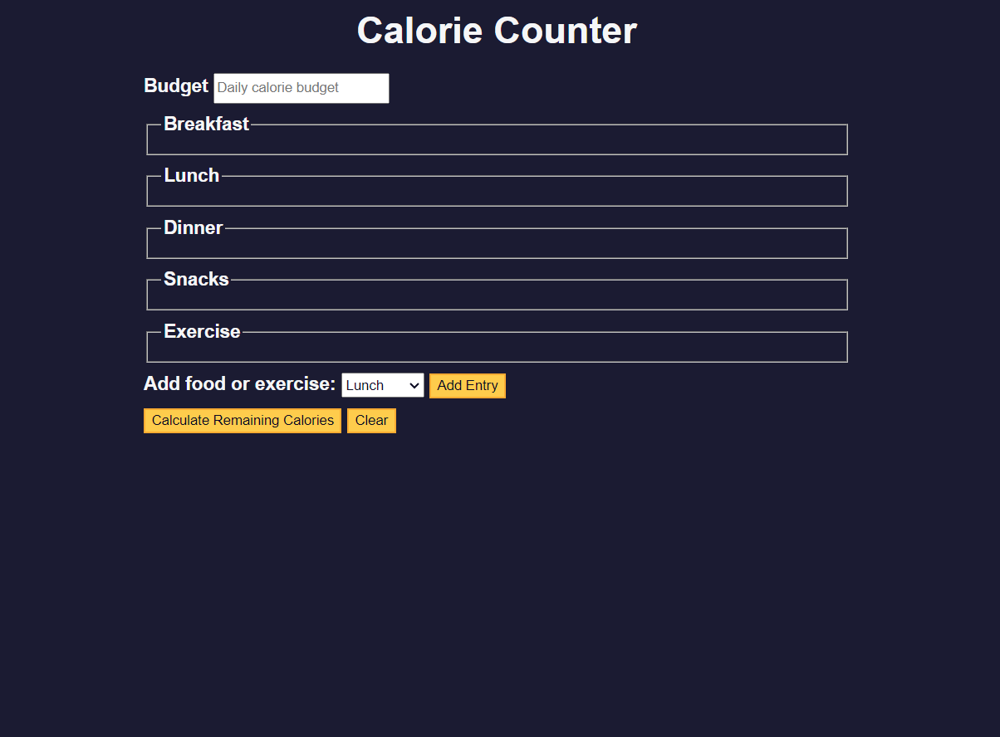

# Calorie-Counter [Website Link](https://kumarshivam04203.github.io/Calorie-Counter/)

## Project Description
Calorie counter project, you'll learn how to validate user input, 
Perform calculations based on that input, and dynamically update your interface to display the results.
* In this practice project, you'll learn basic regular expressions, template literals, the addEventListener() method, and more...
* This Project are calculate the calorie to looping through the string works, creating a new Array is inefficient for memory and runtime performance.
* It is replace the spacial characters using instead you can use Regular Expressions (referred to as "regex") tomatch specific characters.

  => Regex in JavaScript is indicated by a pattern wrapped in forward slashes -> for example  =>  /hello/

* Regex use which match for plus +, minus -, or space replace the pattern in your regex variable => /\+-/
